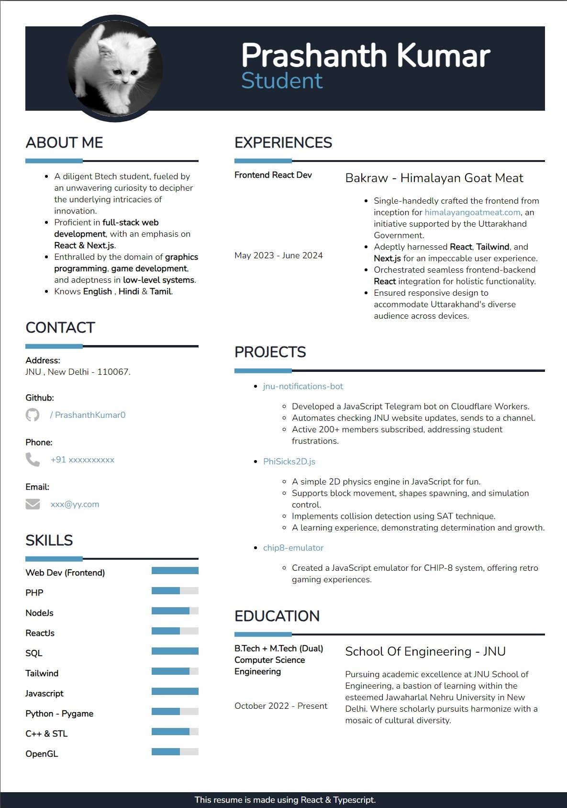

# React Enhanced Resume ⚛️

Welcome to the React Enhanced Resume project! This resume is built using the power of React and elegantly styled with Vanilla CSS.

## Preview 📄
> Feel free to take this resume with no credits. If you find this project helpful, consider giving it a star! 😊

## Customization Guide 🛠️

Follow these simple steps to make it your own:

1. **Clone the Repository**: Copy the repository using `https://github.com/PrashanthKumar0/my-resume`.

2. **Install Dependencies**: Run `npm install` to install the necessary dependencies.

3. **Launch the App**: Start the app with `npm run dev`.

4. **Personalize Your Resume**: Edit the content within [src/data.tsx](src/data.tsx) to customize your resume's content.

5. **Generate PDF**: Open the app in your browser and print the page as a PDF (press `Ctrl+P`), then choose "Print as PDF" from the dialog box.

## Future Plans 🚀

Our dedication to enhancing this project is unwavering. Our upcoming plans include:

- **Expanding Themes**: As more users benefit from this project, we'll introduce new themes for added customization.
